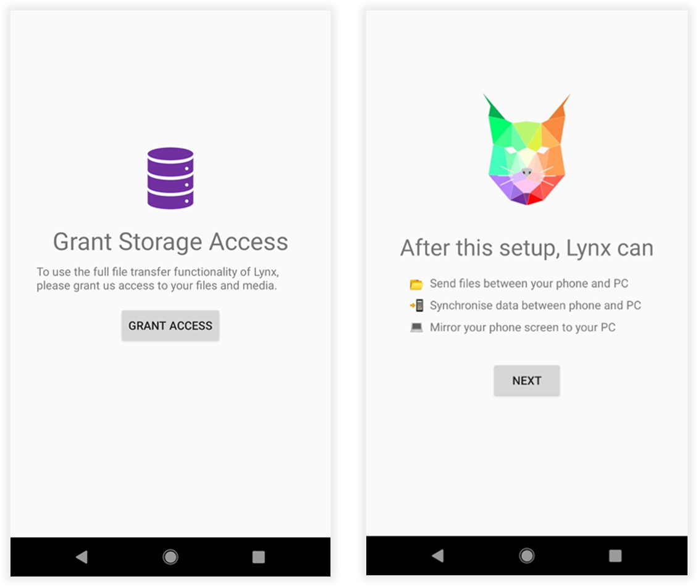
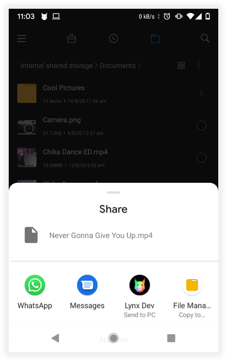
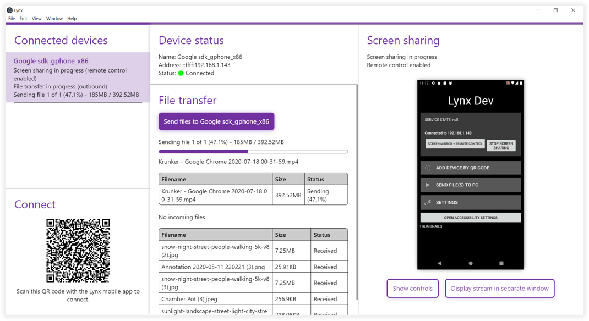
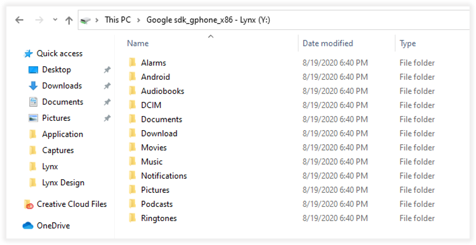

# Lynx
A quick solution for tighter integration of Android devices and Windows PCs, with features such as:

- fast bidirectional file transfer (PC to phone, phone to PC)
- performant, low-latency screen sharing and remote control
- accessing the Android device's files from Windows File Explorer, as a Windows drive
- multiple device support
- 100% wireless operation

## Screenshots
---

### Android App Setup

### Sending Files to PC

### Windows App

### Android Files in Windows File Explorer
